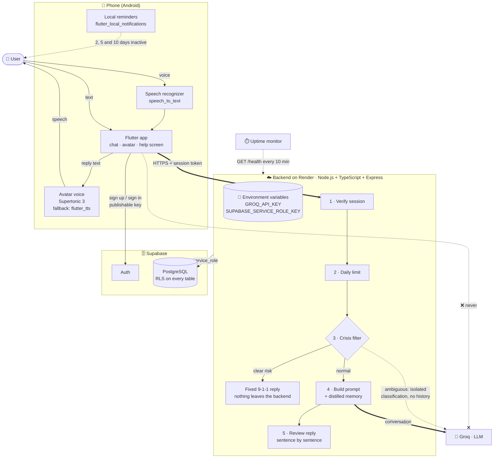

# Architecture — v1

How the pieces of marlix fit together. For the data model see the [ERD](erd.md); for the rules every change must respect see [CONTRIBUTING.md](../CONTRIBUTING.md#non-negotiable-rules).

## Diagram

Thick arrows are the path of a normal chat message. Dotted arrows are background or conditional traffic. The crossed arrow marks a call that must never exist.

## Components

| Component | Runs on | Responsibility |
|---|---|---|
| Flutter app | Phone | Chat and voice screens, animated avatar, help screen, onboarding and settings. Talks only to the backend and to Supabase Auth. |
| Speech recognizer | Phone | Turns the user's voice into text (`speech_to_text`). Free and understands Costa Rican Spanish. |
| Avatar voice | Phone | Turns marlix's reply into speech with Supertonic 3; the native voice (`flutter_tts`) is the fallback. Free, offline and private. |
| Local reminders | Phone | Inactivity reminders scheduled on the phone (`flutter_local_notifications`). No server, no push. |
| Backend | Render (free plan) | The only component that talks to the LLM and writes to the database. Checks the session, the daily limit and the crisis filter, builds the prompt with memory, calls Groq and reviews the reply before returning it. |
| Supabase Auth | Supabase | Sign-up, sign-in and sessions. |
| PostgreSQL | Supabase | Profiles, sessions, messages, memories and usage, with RLS on every table. |
| Groq | Groq cloud (free plan) | Generates chat replies and classifies ambiguous messages. |
| Uptime monitor | External free service | Calls `GET /health` every 10 minutes so the free Render service does not sleep (S7-6). |

## Where the keys live

| Key | Where | Why |
|---|---|---|
| `GROQ_API_KEY` | Backend environment variables on Render (`.env` locally, never committed) | Anyone who extracts it from an app could use up or bill the account. |
| `SUPABASE_SERVICE_ROLE_KEY` | Backend environment variables on Render | It bypasses RLS and gives access to all data. |
| Supabase publishable key | Flutter app | Public by design: it only allows sign-in and what RLS permits. |

The app never holds a secret. That is why **the Flutter app never calls the LLM directly**: every request goes through the backend.

## Voice runs on the phone

Voice mode reuses the same backend path as text chat. The phone turns speech into text, sends it to `POST /chat` like any message, and speaks the reply with the on-device voice. There is no voice endpoint and no audio leaves the phone, so voice costs nothing and the crisis filter applies exactly as in text chat.

## The crisis filter comes first

The crisis filter runs inside the backend, **after** the session and limit checks and **before** any call to the LLM:

- **Clear risk:** the message never leaves the backend. The reply is a fixed text that points to 9-1-1.
- **Ambiguous:** only that message is sent to Groq for an isolated classification, with no history or memory. If it says risk, fails or times out, the crisis protocol is triggered.
- **Normal:** the message continues to the conversation with the model.

It lives in code, not in the system prompt, because a model can be wrong or manipulated and a rule in code cannot. The detailed order of every step is in the chat sequence diagram (S0-8).

## Ready to change providers

The backend talks to the LLM through its own abstraction layer (S1-3), and voice is behind an on-device abstraction. Groq, the voice engine or the hosting can be replaced without changing the app.
