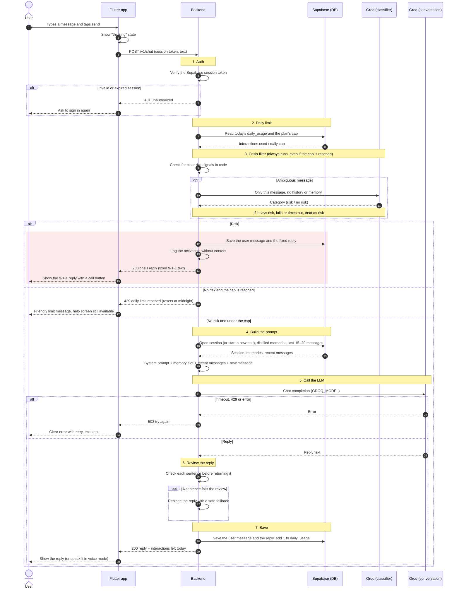

# Sequence diagram — sending a message

What happens from the moment the user sends a chat message until they see the reply ([`POST /v1/chat`](../api-contract.md#post-v1chat), S1-5). Voice mode uses the same path: the phone turns speech into text before sending and speaks the reply after receiving it.

See also the [architecture](../architecture.md), the [ERD](../erd.md) and the non-negotiable rules in [CONTRIBUTING.md](../../CONTRIBUTING.md#non-negotiable-rules).

## Diagram

## Steps

| # | Step | What it guarantees | Card |
|---|---|---|---|
| 1 | **Auth** | Only a signed-in user reaches the rest of the flow. | S4-3 |
| 2 | **Daily limit** | The usage is read before anything else spends quota. The decision is applied after the crisis filter, so a person in crisis always gets help. | S2-6 |
| 3 | **Crisis filter** | Runs before any call to the conversation model. Clear risk never leaves the backend; an ambiguous message only goes to an isolated classification. When in doubt, the protocol is triggered. | S2-1, S2-2, S2-3, S2-5 |
| 4 | **Build the prompt** | The distilled memory is injected into the system prompt slot, with only the last 15 to 20 messages. | S0-10, S4-5, S4-7 |
| 5 | **Call the LLM** | The only call to the conversation model. Errors and rate limits become a clear, retryable error. | S1-3, S1-4, S1-6 |
| 6 | **Review the reply** | Each sentence is checked before it is shown or spoken. | S2-4 |
| 7 | **Save** | The message and the reply are stored together and the interaction is counted, only after a successful reply. | S4-4 |

## The two cases

**A normal message:** steps 1 → 2 → 3 (no risk) → 4 → 5 → 6 → 7. The user sees the reply and how many interactions are left today.

**A crisis message:** steps 1 → 2 → 3 (risk). The message never reaches the conversation model. The user gets the fixed 9-1-1 reply with a call button, and the activation is logged without content.

## Decisions

Decided on 2026-09-30:

- **The crisis filter runs even when the daily cap is reached.** The usage is read in step 2, but a reached cap is only applied to messages without risk. A person in crisis is never told "limit reached" instead of getting help. Crisis replies do not count against the cap.
- **Crisis messages are saved in the user's own history,** together with the fixed reply, so the user sees the help they got when they come back. They are protected by RLS and the 90-day retention, and they never go to Groq or to the logs. The activation log (S2-5) still has no content.
- **Nothing is saved or counted when the LLM fails.** The app keeps the text so the user can retry without retyping it (US-15).
- **Sessions:** if the user's last session had no activity for a while, it is closed and a new one starts. Closing a session is what triggers memory distillation in the background (US-07); that job is not part of this request.

## Out of scope

The voice mode sequence (speech recognition, sentence-by-sentence playback and interruptions) and the memory distillation job.
