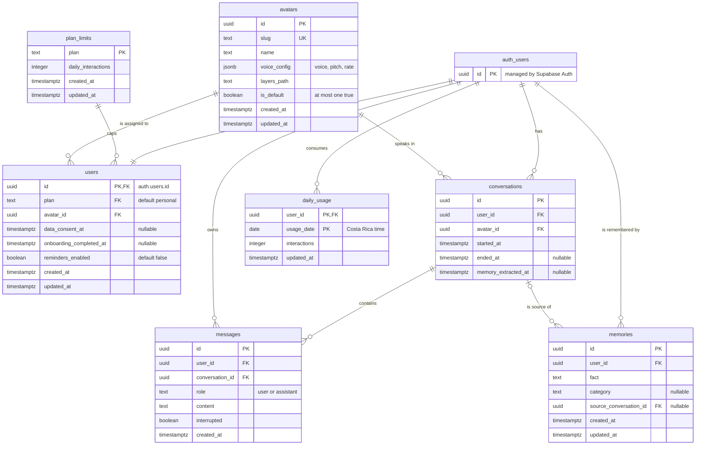

# Entity-relationship diagram — v1

Data model for the marlix MVP, derived from the [user stories](user-stories.md). The SQL that creates it is in [`schema.sql`](schema.sql).

The database is Supabase (PostgreSQL). Sign-up and sign-in are handled by Supabase Auth, which owns the `auth.users` table; every other table lives in the `public` schema.

## Diagram

`auth_users` in the diagram is Supabase's `auth.users` table (Mermaid does not allow dots in entity names).

## Relationships and cardinalities

| Relationship | Cardinality | Notes |
|---|---|---|
| `auth.users` → `users` | 1 to 1 | The profile is created by a trigger on sign-up. |
| `plan_limits` → `users` | 1 to many | Every user has a plan; v1 has only `personal`. |
| `avatars` → `users` | 1 to many | Every user has an avatar; v1 has only one. |
| `auth.users` → `conversations` | 1 to many | A user has many internal sessions. |
| `avatars` → `conversations` | 1 to many | The avatar the session was held with. |
| `conversations` → `messages` | 1 to many | A message belongs to exactly one session. |
| `auth.users` → `messages` | 1 to many | Denormalized owner, used by RLS and retention. |
| `auth.users` → `memories` | 1 to many | Distilled facts about the user. |
| `conversations` → `memories` | 0..1 to many | The session a fact came from; optional. |
| `auth.users` → `daily_usage` | 1 to many | One row per user per day with activity. |

## Tables

| Table | Purpose | Stories |
|---|---|---|
| `users` | App profile: plan, avatar, consent, onboarding state and reminders opt-in. | US-01, US-02, US-14 |
| `plan_limits` | Daily interaction cap per plan. | US-10 |
| `avatars` | Avatar catalog: voice settings and SVG layers folder. | US-13 |
| `conversations` | Internal chat sessions. | US-06, US-07 |
| `messages` | Raw chat history, kept for 90 days. | US-03, US-06, US-12 |
| `memories` | Distilled memory added to the system prompt. | US-07, US-08 |
| `daily_usage` | Interactions per user per day. | US-10 |

## Design decisions

### One continuous chat, many sessions

The user sees a single, continuous chat (decided in S0-5). `conversations` stores **internal sessions**, not separate chats: a session ends after a period of inactivity (`ended_at`), and that is when memory extraction runs (US-07). `memory_extracted_at` marks sessions whose memory was already distilled, so the background job can find pending ones.

### Ready to scale without migrations

Nothing in v2 requires changing the structure, only adding data:

| Today (v1) | Tomorrow (v2) |
|---|---|
| A single avatar in `avatars` | Insert more rows |
| Everyone on `plan = personal` | Add a paid plan in `plan_limits` |
| `avatar_id` points to the only avatar | The user picks another one |

New users get the avatar marked `is_default`, so adding avatars does not change sign-up.

### Account deletion in cascade

Every table with user data references `auth.users` with `on delete cascade`. Deleting the auth user removes the profile, sessions, messages, memories and usage in one step, with nothing left behind (US-09).

### Messages always match their session's owner

`messages` references `conversations` through the pair `(conversation_id, user_id)`, so a message can never point to another user's session.

### Daily usage in Costa Rica time

`usage_date` defaults to the current date in `America/Costa_Rica`, so the daily cap resets at local midnight, which is what the user is told (US-10).

## Access and Row Level Security

Every table has RLS enabled. The backend connects with the `service_role` key, which bypasses RLS, and is the **only writer** of sessions, messages, memories and usage. That way the crisis filter and the daily cap cannot be skipped by writing to the database from the app.

What a signed-in user (`authenticated`) can do, always limited to their own rows:

| Table | Read | Create | Update | Delete |
|---|---|---|---|---|
| `users` | ✅ | — (trigger) | Only `data_consent_at`, `onboarding_completed_at` and `reminders_enabled` | — (account deletion) |
| `plan_limits` | ✅ all rows | — | — | — |
| `avatars` | ✅ all rows | — | — | — |
| `conversations` | ✅ | — | — | — |
| `messages` | ✅ | — | — | — |
| `memories` | ✅ | — | Only `fact` | ✅ |
| `daily_usage` | ✅ | — | — | — |

Anonymous users (`anon`) have no access. Column-level grants stop a user from changing their own `plan` or `avatar_id`.

## Out of scope

- Creating the real Supabase project (S4-1).
- Deleting messages older than 90 days: the scheduled job is S4-10; `messages_created_at_idx` is ready for it.
- Crisis activation log without content: S2-5.
- Scheduling inactivity reminders: they are local notifications on the phone (S5-3). The database only stores the opt-in (`reminders_enabled`).

## How to test

Start the local database with Docker (see [Local database](../README.md#local-database) in the README). On the first start it applies [`schema.sql`](schema.sql) to a clean database; check the seven tables exist.
