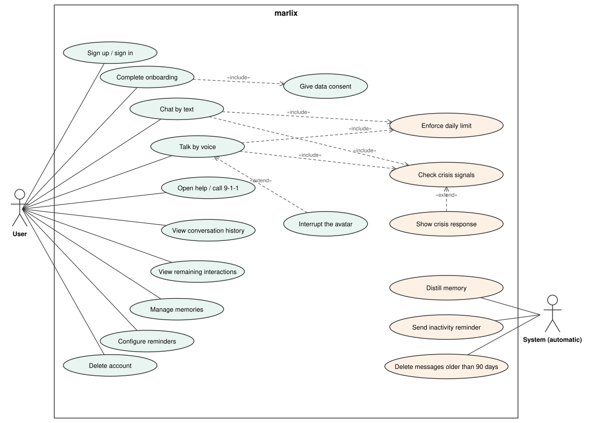

# Use cases — v1

UML use case diagram for the marlix MVP, derived from the [user stories](user-stories.md).

The diagram is a `.drawio.svg` file: GitHub renders it as an image, and it can be edited by opening it in [draw.io](https://app.diagrams.net) or with the Draw.io Integration extension for VS Code.

## Actors

| Actor | Description |
|---|---|
| **User** | A person who uses marlix for companionship. v1 has a single user type (no paid plan). |
| **System (automatic)** | Processes that run on their own, triggered by time or by the end of a conversation, without a direct user action. |

## Use cases

### User

| ID | Use case | Story |
|---|---|---|
| UC-01 | Sign up / sign in | US-01 |
| UC-02 | Complete onboarding | US-02 |
| UC-03 | Chat by text | US-03 |
| UC-04 | Talk by voice | US-11 |
| UC-05 | Open help / call 9-1-1 | US-05 |
| UC-06 | View conversation history | US-06 |
| UC-07 | View remaining interactions | US-10 |
| UC-08 | Manage memories | US-08 |
| UC-09 | Configure reminders | US-14 |
| UC-10 | Delete account | US-09 |
| UC-11 | Give data consent | US-02 |
| UC-12 | Interrupt the avatar | US-12 |

### System

| ID | Use case | Story |
|---|---|---|
| UC-13 | Enforce daily limit | US-10 |
| UC-14 | Check crisis signals | US-04 |
| UC-15 | Show crisis response | US-04 |
| UC-16 | Distill memory | US-07 |
| UC-17 | Send inactivity reminder | US-14 |
| UC-18 | Delete messages older than 90 days | US-06 |

## Relationships

| Relationship | Meaning |
|---|---|
| Complete onboarding «include» Give data consent | Onboarding cannot finish without explicit consent. |
| Chat by text «include» Enforce daily limit | Every text message counts against the daily cap. |
| Chat by text «include» Check crisis signals | Every text message goes through the crisis filter before the model. |
| Talk by voice «include» Enforce daily limit | Every voice turn counts against the daily cap. |
| Talk by voice «include» Check crisis signals | The crisis filter applies to voice exactly as to text. |
| Interrupt the avatar «extend» Talk by voice | Optional: only happens if the user talks while the avatar is speaking. |
| Show crisis response «extend» Check crisis signals | Only happens when the filter detects risk, or when an ambiguous message cannot be cleared. |

## Crisis flow

The crisis flow is modeled as system use cases (UC-14 and UC-15) because it runs on every message, without the user asking for it. It is included by both chat and voice, so there is no path to the model that skips it. See the non-negotiable rules in [CLAUDE.md](../CLAUDE.md).

## Not modeled as use cases

Some stories describe how the app behaves rather than something an actor does, so they are not use cases:

- **US-13 Animated avatar**: the avatar's states are part of Chat by text and Talk by voice.
- **US-15 Clear errors and waiting states**: applies to every use case.

## v2

When a paid plan is added, a **Premium user** actor is added as a specialization of **User**, without redoing the diagram.
